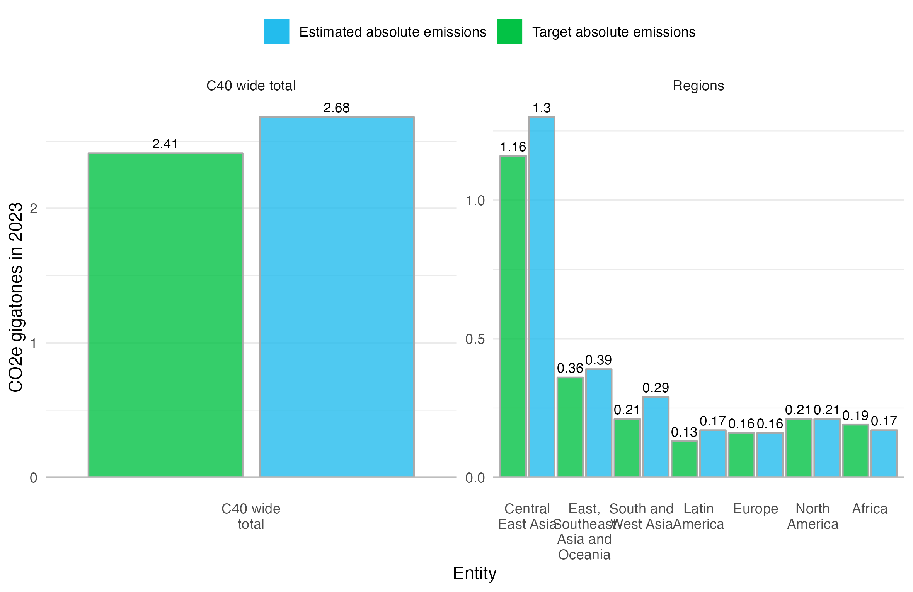
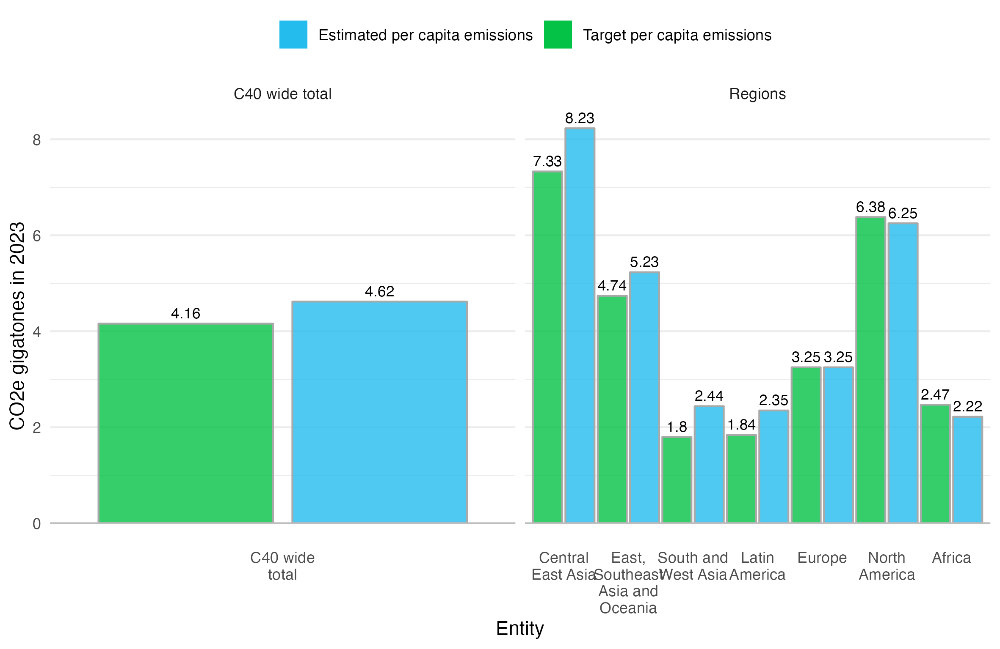
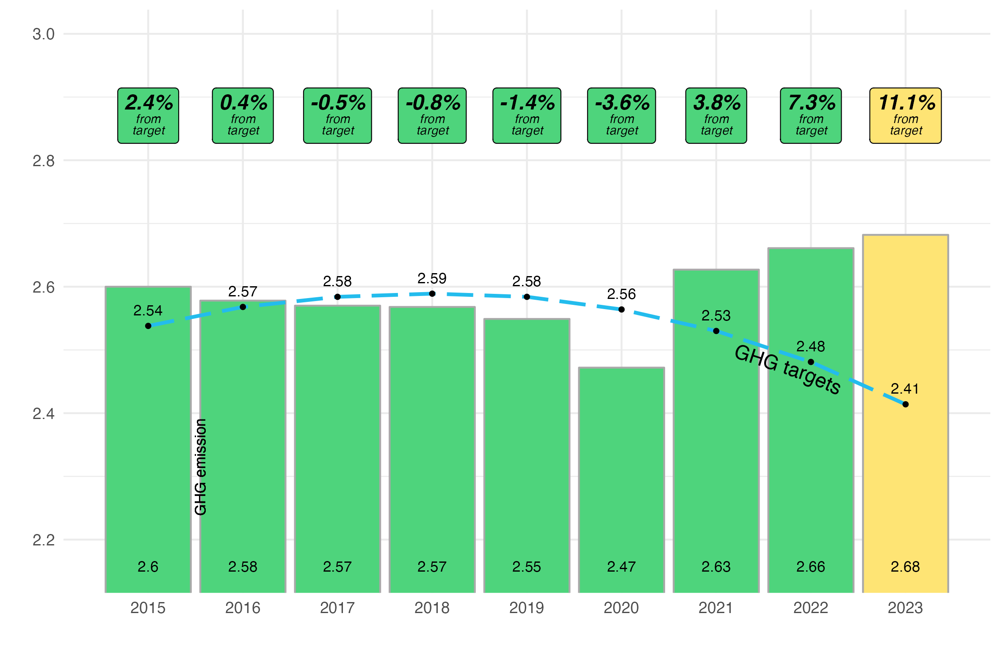
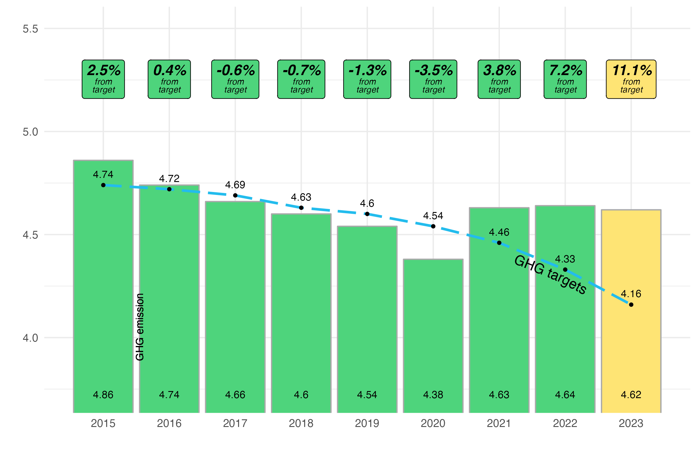

```{r setup, include=FALSE}
knitr::opts_chunk$set(echo = FALSE, message = FALSE, warning = FALSE)
```

```{r}
source(here::here("etl/00-libraries.R"))
source(here("etl/01_extract.R"))
source(here("etl/02_transform.R"))
source(here("etl/viz.R"))
```


## GHG total breakdown by region - GtCO₂e - Absolute: actual vs. target

```{r}

viz_output_vs_absolute <- viz_emissions_vs_target_absolute
viz_output_vs_absolute$layers[[2]]$geom$default_aes$size <- 3

ggsave(plot = viz_output_vs_absolute, 
       path = here("doc_pages/export_files/img"),
       filename = "viz_output_vs_absolute.png",
       width = 20, height = 13,
       units = "cm")
```

{width=50%}


## GHG total breakdown by region - GtCO₂e - Per capita: actual vs. target

```{r}
viz_output_vs_percapita <- viz_emissions_vs_target_percapita
ggsave(plot = viz_output_vs_percapita, 
       path = here("doc_pages/export_files/img"),
       filename = "viz_output_vs_percapita.png",
       width = 20, height = 13,
       units = "cm")
```

{width=50%}

## GHG historical by region - GtCO₂e - TOTAL

```{r}
viz_output_hist_absolute <- viz_emissions_history_absolute

viz_output_hist_absolute$layers[[6]]$computed_mapping$vjust <- 15
ggsave(plot = viz_output_hist_absolute, 
       path = here("doc_pages/export_files/img"),
       filename = "viz_output_hist_absolute.png",
       width = 20, height = 13,
       units = "cm")
```

{width=60%}


## GHG historical by region - tCO₂e - PER CAPITA

```{r}
viz_output_hist_percapita <- viz_emissions_history_percapita

viz_output_hist_percapita$layers[[6]]$computed_mapping$vjust <- 15
ggsave(plot = viz_output_hist_percapita, 
       path = here("doc_pages/export_files/img"),
       filename = "viz_output_hist_percapita.png",
       width = 20, height = 13,
       units = "cm")
```


{width=60%}


## OVERALL GHG TREND
```{r}
ghg_trend_path <- paste0(get_googledrive_path(),
               "Shared drives/BPMI/Business Planning and Reporting/C40 Analytics Team /KPIs and GHG forecasting/Outputs KPIs/CAP cities trajectories.png")

```

{width=40%}
## Mode share

## Electric chargers

## HIAs

## City vs national gov emission reduction